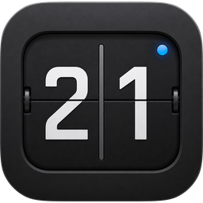
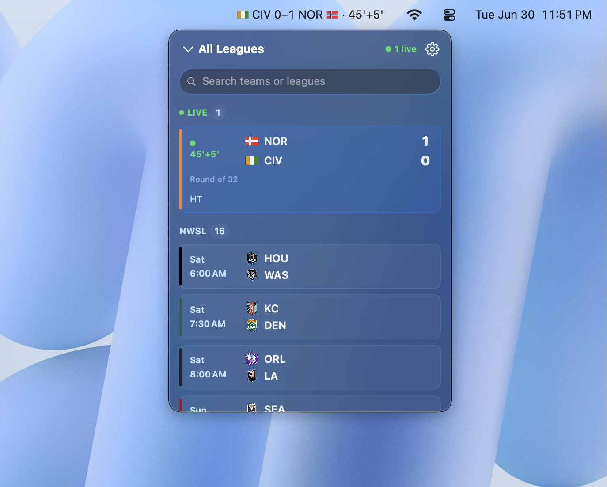
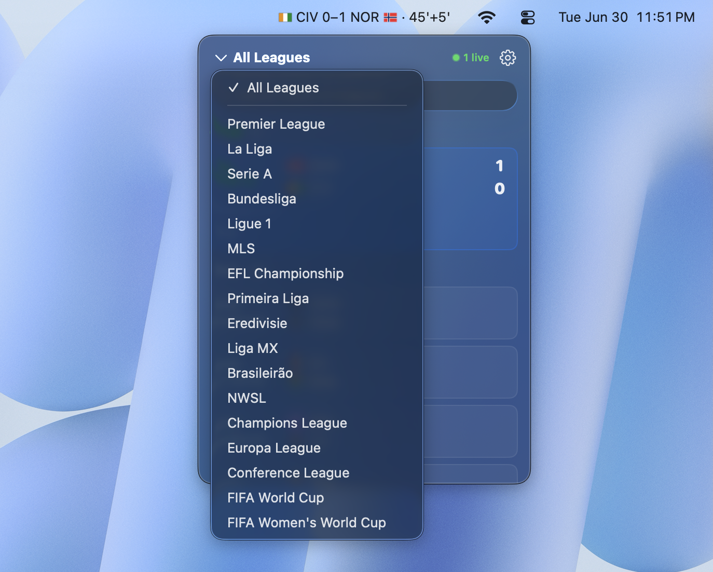
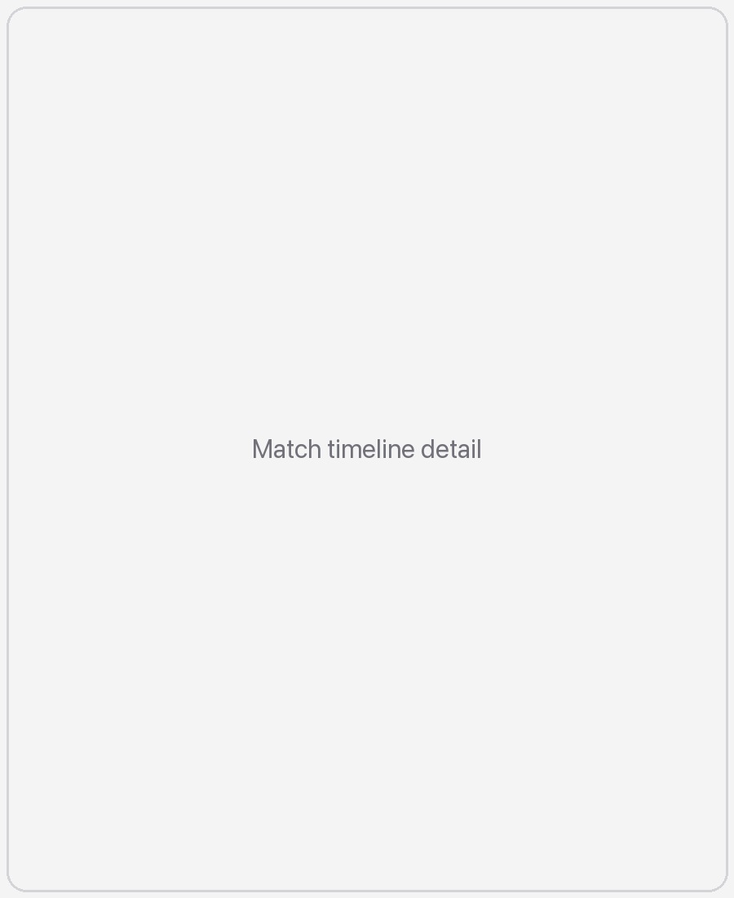

<div align="center">



# StatBar

**Live football scores in your macOS menu bar. Free and open source.**

[](https://github.com/ishm6m/statbar/releases/latest)

[](https://github.com/ishm6m/statbar/releases/latest)
[](https://swift.org)
[](LICENSE)
[](https://github.com/ishm6m/statbar/stargazers)



<picture>
  <source media="(prefers-color-scheme: dark)" srcset="docs/images/leagues-bar-dark.png">
  
</picture>

</div>

StatBar is a lightweight menu-bar agent that puts live scores from the world's
top football leagues and competitions a glance away — no window to switch to, no
browser tab. Tap a match for the full story: a complete timeline of goals,
cards, and substitutions.

## Features

- **Always in reach** — scores live in the menu bar, updated in real time.
- **Smart Focus** — surfaces the game that matters right now (the close one, the
  one in overtime, the team you follow).
- **Follow your team** — the menu bar tracks your team: live score → full-time
  result → next fixture.
- **Real crests & flags** — official logos fetched live, clean monogram fallback.
- **Quiet by design** — refreshes fast when games are live, sleeps when they're
  not. Native, lightweight, battery-friendly.
- **Notifications** — match starting, goals, and final scores.

<table>
  <tr>
    <td width="50%"></td>
    <td width="50%"></td>
  </tr>
  <tr>
    <td align="center"><b>Every match, one glance</b></td>
    <td align="center"><b>Full match timeline</b></td>
  </tr>
</table>

**Leagues:** Premier League, La Liga, Serie A, Bundesliga, Ligue 1, MLS, EFL
Championship, Primeira Liga, Eredivisie, Liga MX, Brasileirão, NWSL.
**Cups:** Champions League, Europa League, Conference League, FIFA World Cup,
FIFA Women's World Cup.

Data comes from ESPN's public endpoints. Not affiliated with any league or
broadcaster.

## Install

Download the latest `StatBar.app.zip` from
[Releases](https://github.com/ishm6m/statbar/releases/latest), unzip, and drag
**StatBar.app** to `/Applications`.

> macOS 13 (Ventura) or later.

The build is ad-hoc signed (no Apple Developer ID), so on first launch macOS
will warn it's from an unidentified developer. Right-click the app → **Open**,
or allow it under **System Settings → Privacy & Security**.

## Build from source

Requires a recent Swift toolchain (Xcode 16 / Swift 6).

```sh
swift build -c release   # build the binary
make                     # build the StatBar.app bundle (ad-hoc codesigned)
```

The bundle lands in `build/`. `make` runs the release build and packages it.

## Project layout

- `Sources/StatBar/` — the app (SwiftUI + AppKit menu-bar agent).
- `Tests/` — unit tests (`swift test`).
- `Resources/` — assets bundled into the app.
- `site/` — marketing landing page (Next.js).
- `version.json` — update manifest read by the in-app update checker.

## License

[MIT](LICENSE) © 2026 StatBar contributors.
